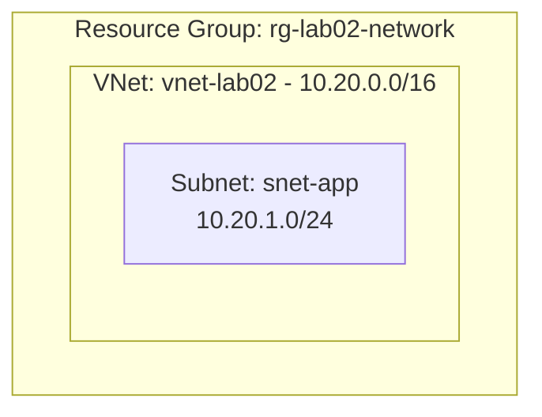

# Lab 02: VNet + Subnet

Creates a new Resource Group, Virtual Network, and one Subnet using input variables with defaults.



## Run it

```bash
terraform init
terraform plan
terraform apply
```

Clean up when done:

```bash
terraform destroy
```

## Key concepts

- **Virtual Network (VNet)** - a private network in Azure where resources can communicate securely.
- **Subnet** - a smaller address range inside a VNet used to organize and isolate resources.
- **CIDR** - notation for an IP address range, such as `10.20.0.0/16`. A subnet's range must fit inside the VNet's range.
- **Input variables** - configurable values declared in `variables.tf`. This lab includes defaults, keeping names, regions, and address ranges out of the resource definitions without requiring extra files.
- **Outputs** - values Terraform displays after an apply. This lab returns the Resource Group name and the Azure IDs of the VNet and Subnet.
